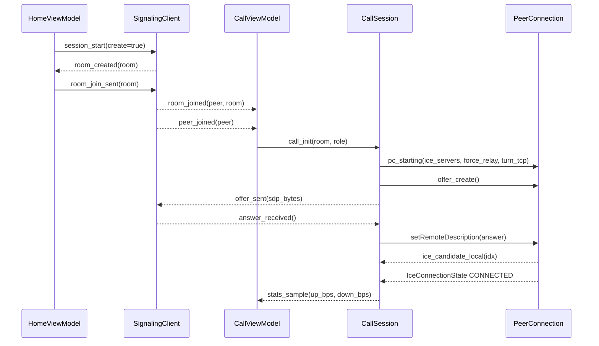
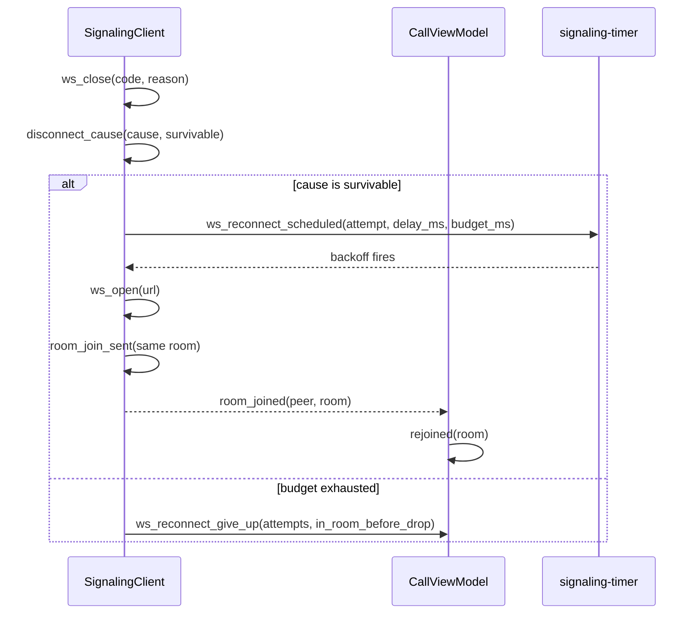
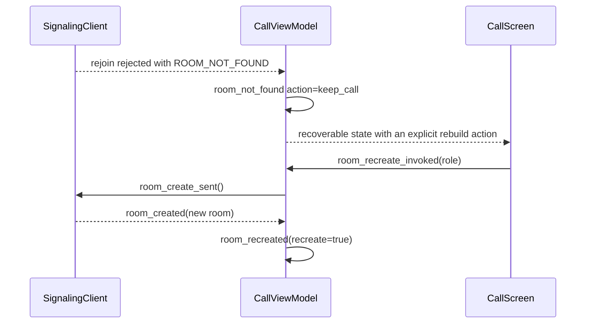
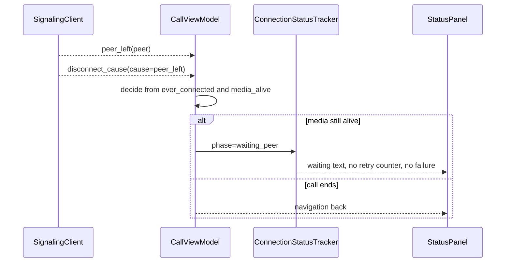
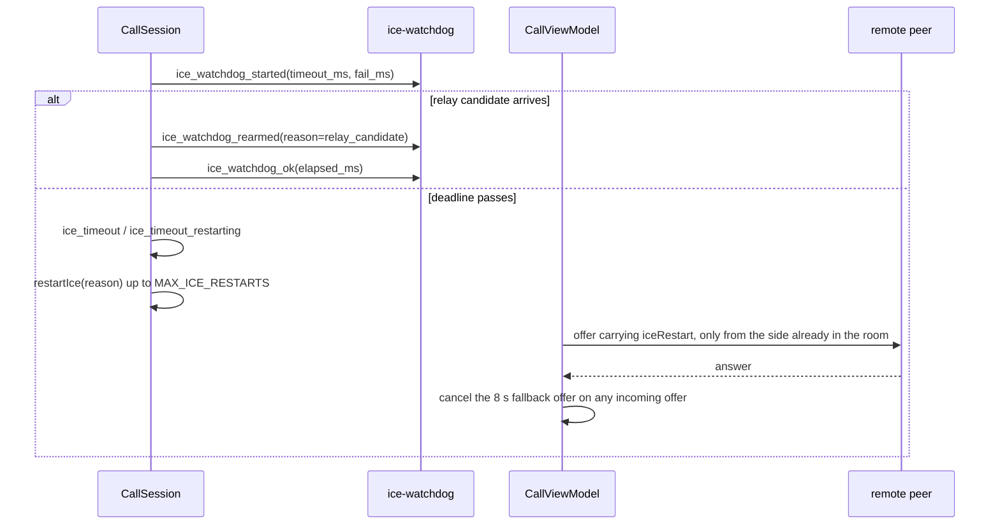
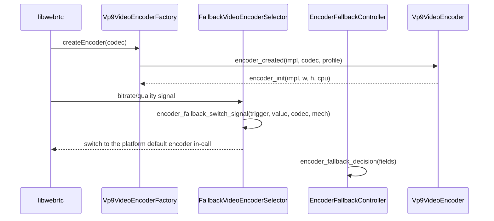
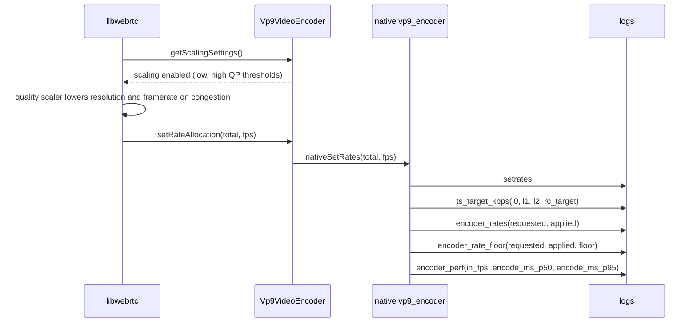

> [中文（默认）](zh-CN/06-flows.md) · English

# 06 — Key flows

> Status: draft · Owner: writer-app · Task: t3
> Evidence base: `reports/27-encoder-direction-perf.md`, `reports/34-turn-tcp-fallback.md`, `reports/35-room-grace.md`, `reports/36-call-survivability.md`, `reports/39-reconnect-budget-ice-restart.md`, `reports/40-glare-ice-restart-fix.md`, `reports/44-ice-watchdog-false-failure.md`, `reports/47-vp9-encode-perf.md`, `reports/48-encoder-fallback.md`, `reports/49-bitrate-allocation-collapse.md`, `reports/50-quality-scaling-and-render-fps.md`, `reports/51-frame-dropper-and-trusted-rc.md`; verbatim log lines from seven device captures under the container path pattern /data/dsh/home/workspace/tmp/n1…n7/x/.
> Doc standard: `doc/design/SPEC.md`

## 1. Scope

This document traces the seven flows that define the application's behaviour. Each flow has a diagram, a
numbered step list with source citations, and at least two verbatim lines from a real device capture. The log
lines are quoted exactly as written, including the timestamp and the thread-id bracket, because the fields after
the event name are the diagnostic contract.

Log evidence is cited as a bare container path inside a code span — for example the n1 application log at
`/data/dsh/home/workspace/tmp/n1/x/app.log` — with the line numbers given in prose. The line number is kept
outside the code span on purpose: a container path carrying a line suffix is classified as an off-repository
citation by the checker, which downgrades it to a warning instead of verifying it.

## 2. Flow 1 — Create a room, join, first offer/answer, ICE connectivity



Steps:

1. The home screen starts a session: the URL and the create flag are logged before the socket opens
   (`app/src/main/kotlin/com/example/webrtcdemo/ui/home/HomeViewModel.kt:138`).
2. The room is created and joined by the transport layer, which logs both outcomes
   (`app/src/main/kotlin/com/example/webrtcdemo/signaling/SignalingClient.kt:587`,
   `app/src/main/kotlin/com/example/webrtcdemo/signaling/SignalingClient.kt:588`).
3. When the remote peer enters, the peer-joined notification is logged before the orchestration layer reacts
   (`app/src/main/kotlin/com/example/webrtcdemo/signaling/SignalingClient.kt:594`).
4. The orchestration layer enters the call and records the role, room and generation
   (`app/src/main/kotlin/com/example/webrtcdemo/ui/call/CallViewModel.kt:584`).
5. The session announces itself together with the transport decisions — ICE server kinds, forced relay, and
   whether the TURN-over-TCP fallback was added
   (`app/src/main/kotlin/com/example/webrtcdemo/webrtc/CallSession.kt:306`).
6. The offer is created and sent; both steps carry byte counts so an empty or truncated SDP is visible
   (`app/src/main/kotlin/com/example/webrtcdemo/webrtc/CallSession.kt:420`,
   `app/src/main/kotlin/com/example/webrtcdemo/webrtc/CallSession.kt:430`).
7. The answer side mirrors the same two events
   (`app/src/main/kotlin/com/example/webrtcdemo/webrtc/CallSession.kt:497`,
   `app/src/main/kotlin/com/example/webrtcdemo/webrtc/CallSession.kt:507`).
8. Local candidates are logged individually, so the host/srflx/relay mix is auditable per candidate
   (`app/src/main/kotlin/com/example/webrtcdemo/webrtc/CallSession.kt:900`).

Observed on device — room creation on n1 (`/data/dsh/home/workspace/tmp/n1/x/app.log`, line 40), the peer joining
(line 89), the offer (lines 95 and 99) and the first local candidate (line 102):

```text
2026-09-16T03:34:08.932Z INFO    kotlin signaling [2098/10251] room_created room=2C5MZN
2026-09-16T03:34:24.659Z INFO    kotlin signaling [2098/10251] peer_joined peer=peer-002
2026-09-16T03:34:24.677Z INFO    kotlin pc        [2098/10269] offer_created candidates=- evt=6 sdp_bytes=2528 session=s1
2026-09-16T03:34:24.732Z INFO    kotlin signaling [2098/10269] offer_sent sdp_bytes=2528
2026-09-16T03:34:24.758Z INFO    kotlin pc        [2098/10269] ice_candidate_local evt=8 idx=0 local=type=host_proto=udp_addr=192.168.1.100_port=45509 mid=0 session=s1
```

The answering side of a later session on n2 (`/data/dsh/home/workspace/tmp/n2/x/app.log`, line 13057):

```text
2026-09-16T07:39:21.475Z INFO    kotlin pc        [28710/783] answer_created candidates=- evt=9 sdp_bytes=2450 session=s2
```

References: `app/src/main/kotlin/com/example/webrtcdemo/ui/home/HomeViewModel.kt:138`,
`app/src/main/kotlin/com/example/webrtcdemo/signaling/SignalingClient.kt:587`,
`app/src/main/kotlin/com/example/webrtcdemo/signaling/SignalingClient.kt:588`,
`app/src/main/kotlin/com/example/webrtcdemo/signaling/SignalingClient.kt:594`,
`app/src/main/kotlin/com/example/webrtcdemo/ui/call/CallViewModel.kt:584`,
`app/src/main/kotlin/com/example/webrtcdemo/webrtc/CallSession.kt:306`,
`app/src/main/kotlin/com/example/webrtcdemo/webrtc/CallSession.kt:420`,
`app/src/main/kotlin/com/example/webrtcdemo/webrtc/CallSession.kt:430`,
`app/src/main/kotlin/com/example/webrtcdemo/webrtc/CallSession.kt:497`,
`app/src/main/kotlin/com/example/webrtcdemo/webrtc/CallSession.kt:507`,
`app/src/main/kotlin/com/example/webrtcdemo/webrtc/CallSession.kt:900`

## 3. Flow 2 — Transient signalling drop, reconnect, and reclaiming the seat



Steps:

1. A socket close is logged with its code and reason
   (`app/src/main/kotlin/com/example/webrtcdemo/signaling/SignalingClient.kt:313`).
2. The close is classified into a survivable or fatal cause before any recovery is attempted
   (`app/src/main/kotlin/com/example/webrtcdemo/signaling/SignalingClient.kt:790`).
3. A survivable close schedules a reconnect using the rejoin backoff — base 1 s, capped at 8 s, at most ten
   attempts (`app/src/main/kotlin/com/example/webrtcdemo/signaling/SignalingClient.kt:145`,
   `app/src/main/kotlin/com/example/webrtcdemo/signaling/SignalingClient.kt:749`); the schedule line carries the
   total budget so the capture proves the window it is working with.
4. On success the client rejoins the same room and the transport logs the join
   (`app/src/main/kotlin/com/example/webrtcdemo/signaling/SignalingClient.kt:588`).
5. The orchestration layer notes that the call survived the drop
   (`app/src/main/kotlin/com/example/webrtcdemo/ui/call/CallViewModel.kt:869`).
6. If the budget is exhausted the client gives up explicitly, and records whether the device was in a room when
   the drop happened (`app/src/main/kotlin/com/example/webrtcdemo/signaling/SignalingClient.kt:731`).

Observed on device — a drop and the successful reclaim on n2 (`/data/dsh/home/workspace/tmp/n2/x/app.log`, lines
1222, 1223, 1244 and 1246):

```text
2026-09-16T03:35:09.217Z WARN    kotlin signaling [2098/10251] ws_close code=- reason=failure
2026-09-16T03:35:09.217Z WARN    kotlin signaling [2098/10251] ws_reconnect_scheduled attempt=1 budget_ms=63000 delay_ms=1000 max_attempts=10 reason=failure
2026-09-16T03:35:11.355Z INFO    kotlin signaling [2098/10251] room_joined peer=peer-001 room=2C5MZN
2026-09-16T03:35:11.356Z INFO    kotlin pc        [2098/10251] rejoined room=2C5MZN
```

The exhausted path on n7 (`/data/dsh/home/workspace/tmp/n7/x/app.1.log`, line 5991):

```text
2026-09-16T15:40:57.107Z ERROR   kotlin signaling [2568/14461] ws_reconnect_give_up attempts=11 budget_ms=63000 in_room_before_drop=true room=FANFQ2
```

References: `app/src/main/kotlin/com/example/webrtcdemo/signaling/SignalingClient.kt:145`,
`app/src/main/kotlin/com/example/webrtcdemo/signaling/SignalingClient.kt:313`,
`app/src/main/kotlin/com/example/webrtcdemo/signaling/SignalingClient.kt:588`,
`app/src/main/kotlin/com/example/webrtcdemo/signaling/SignalingClient.kt:731`,
`app/src/main/kotlin/com/example/webrtcdemo/signaling/SignalingClient.kt:749`,
`app/src/main/kotlin/com/example/webrtcdemo/signaling/SignalingClient.kt:790`,
`app/src/main/kotlin/com/example/webrtcdemo/ui/call/CallViewModel.kt:869`

## 4. Flow 3 — Room invalidated (room not found) and the recoverable state



Steps:

1. A room that was reclaimed during a reconnect surfaces as `ROOM_LOST`, which is survivable by construction
   (`app/src/main/kotlin/com/example/webrtcdemo/signaling/SignalingClient.kt:798`).
2. The orchestration layer keeps the call instead of hanging up and logs the decision together with the phase
   and the media state (`app/src/main/kotlin/com/example/webrtcdemo/ui/call/CallViewModel.kt:1062`).
3. The user is offered an explicit rebuild entry point
   (`app/src/main/kotlin/com/example/webrtcdemo/ui/call/CallViewModel.kt:693`).
4. A successful rebuild is announced with the new room and the same generation
   (`app/src/main/kotlin/com/example/webrtcdemo/ui/call/CallViewModel.kt:837`).
5. If the rebuild cannot proceed because the room is full, that is reported separately rather than as a fatal
   error (`app/src/main/kotlin/com/example/webrtcdemo/ui/call/CallViewModel.kt:1046`).

Observed on device — the recoverable decision on n6 (`/data/dsh/home/workspace/tmp/n6/x/app.2.log`, line 13492):

```text
2026-09-16T15:55:54.455Z WARN    kotlin pc        [20650/24180] room_not_found_action=keep_call code=ROOM_NOT_FOUND media_age_ms=-1 media_alive=true phase=connected rejoin_context=true rejoin_drop=true seq=3 session=s3
```

The rebuild on n7 (`/data/dsh/home/workspace/tmp/n7/x/app.1.log`, lines 6624 and 6634):

```text
2026-09-16T15:55:56.139Z WARN    kotlin pc        [2568/2568] room_recreate_invoked media_alive=true role=joiner room=FANFQ2 seq=5 session=s5
2026-09-16T15:55:56.337Z INFO    kotlin pc        [2568/16211] room_recreated recreate=true room=XUWTS7 seq=5 session=s5
```

References: `app/src/main/kotlin/com/example/webrtcdemo/signaling/SignalingClient.kt:798`,
`app/src/main/kotlin/com/example/webrtcdemo/ui/call/CallViewModel.kt:693`,
`app/src/main/kotlin/com/example/webrtcdemo/ui/call/CallViewModel.kt:837`,
`app/src/main/kotlin/com/example/webrtcdemo/ui/call/CallViewModel.kt:1046`,
`app/src/main/kotlin/com/example/webrtcdemo/ui/call/CallViewModel.kt:1062`

## 5. Flow 4 — Peer leaves, waiting for a peer, entering again



Steps:

1. The transport reports the peer leaving and then classifies the resulting disconnect
   (`app/src/main/kotlin/com/example/webrtcdemo/signaling/SignalingClient.kt:595`,
   `app/src/main/kotlin/com/example/webrtcdemo/signaling/SignalingClient.kt:533`).
2. The orchestration layer decides whether to keep the call using two inputs recorded on the same line:
   whether the call had ever connected and whether media is still alive
   (`app/src/main/kotlin/com/example/webrtcdemo/ui/call/CallViewModel.kt:912`).
3. The alternative branch ends the call for that generation
   (`app/src/main/kotlin/com/example/webrtcdemo/ui/call/CallViewModel.kt:935`).
4. The neutral waiting phase exists as a first-class state, not as an error
   (`app/src/main/kotlin/com/example/webrtcdemo/ui/call/ConnectionStatus.kt:33`).
5. The phase is published together with the reason, the liveness evidence and the generation
   (`app/src/main/kotlin/com/example/webrtcdemo/ui/call/CallViewModel.kt:1475`), and the field that carries it is
   named exactly as it appears in captures
   (`app/src/main/kotlin/com/example/webrtcdemo/ui/call/CallViewModel.kt:465`).

Observed on device — the peer leaving on n2 (`/data/dsh/home/workspace/tmp/n2/x/app.log`, lines 7103 and 7104):

```text
2026-09-16T03:39:43.060Z INFO    kotlin signaling [11943/14419] peer_left peer=peer-002
2026-09-16T03:39:43.061Z WARN    kotlin signaling [11943/14419] disconnect_cause cause=peer_left peer_left=true
```

The waiting phase at call start on n1 (`/data/dsh/home/workspace/tmp/n1/x/app.log`, line 47):

```text
2026-09-16T03:34:09.155Z INFO    kotlin pc        [2098/2098] ui_conn_state elapsed_ms=0 frame=false ice_down=false media_age_ms=-1 media_source=none pair=false phase=waiting_peer reason=none retry=0 seq=1 session=s0 stalled=false
```

Note that the keep-call branch itself was not captured in these seven sessions: every observed `peer_left` line is
the bare notification, and no `peer_left action=keep_call` line appears in any capture. The branch is therefore
documented from code, not from a device observation.

References: `app/src/main/kotlin/com/example/webrtcdemo/signaling/SignalingClient.kt:533`,
`app/src/main/kotlin/com/example/webrtcdemo/signaling/SignalingClient.kt:595`,
`app/src/main/kotlin/com/example/webrtcdemo/ui/call/CallViewModel.kt:465`,
`app/src/main/kotlin/com/example/webrtcdemo/ui/call/CallViewModel.kt:912`,
`app/src/main/kotlin/com/example/webrtcdemo/ui/call/CallViewModel.kt:935`,
`app/src/main/kotlin/com/example/webrtcdemo/ui/call/CallViewModel.kt:1475`,
`app/src/main/kotlin/com/example/webrtcdemo/ui/call/ConnectionStatus.kt:33`

## 6. Flow 5 — ICE restart and the anti-glare division of labour



Steps:

1. The watchdog is armed once per session with both thresholds on the same line, plus whether TURN was
   configured (`app/src/main/kotlin/com/example/webrtcdemo/webrtc/CallSession.kt:1125`).
2. Arrival of a relay candidate re-arms the deadline instead of letting the original one expire
   (`app/src/main/kotlin/com/example/webrtcdemo/webrtc/CallSession.kt:1346`).
3. Proven connectivity stops the watchdog and is recorded with its elapsed time
   (`app/src/main/kotlin/com/example/webrtcdemo/webrtc/CallSession.kt:1380`).
4. A missed deadline is logged with the full candidate and transport context, which is what makes a false
   failure diagnosable (`app/src/main/kotlin/com/example/webrtcdemo/webrtc/CallSession.kt:1233`,
   `app/src/main/kotlin/com/example/webrtcdemo/webrtc/CallSession.kt:1225`).
5. Restart is bounded: at most two attempts
   (`app/src/main/kotlin/com/example/webrtcdemo/webrtc/CallSession.kt:100`), requested through a single method
   (`app/src/main/kotlin/com/example/webrtcdemo/webrtc/CallSession.kt:1272`).
6. Only the side that was already in the room renegotiates; the reconnecting side answers and arms an 8 s
   fallback offer (`app/src/main/kotlin/com/example/webrtcdemo/ui/call/CallSurvivability.kt:147`), and the
   fallback is cancelled as soon as a remote offer or answer arrives
   (`app/src/main/kotlin/com/example/webrtcdemo/ui/call/CallViewModel.kt:875`).

Observed on device — the watchdog lifecycle on n1 (`/data/dsh/home/workspace/tmp/n1/x/app.log`, lines 129, 115
and 163):

```text
2026-09-16T03:34:25.130Z INFO    kotlin pc        [2098/10251] ice_watchdog_started evt=22 fail_ms=45000 session=s1 timeout_ms=30000 turn_configured=true
2026-09-16T03:34:24.872Z INFO    kotlin pc        [2098/10269] ice_watchdog_rearmed candidate=type=relay_proto=udp_addr=47.238.144.66_port=49181 elapsed_ms=1789529664872 evt=16 reason=relay_candidate relay=1 session=s1
2026-09-16T03:34:25.436Z INFO    kotlin pc        [2098/10269] ice_watchdog_ok elapsed_ms=306
```

The anti-glare deferral on n3 (`/data/dsh/home/workspace/tmp/n3/x/app.1.log`, line 47):

```text
2026-09-16T03:34:24.955Z WARN    kotlin pc        [21491/21555] offer_deferred evt=3 reason=pc_not_ready sdp_bytes=2528 session=s1 start_in_flight=true
```

Important limitation: the restart branch itself was never exercised in these seven captures. Every restart counter
in the capture set is zero, and no restart request, exhaustion or failure line appears anywhere. The restart
mechanism is therefore documented from code, and the captured evidence covers the watchdog and the deferral paths
only.

References: `app/src/main/kotlin/com/example/webrtcdemo/webrtc/CallSession.kt:100`,
`app/src/main/kotlin/com/example/webrtcdemo/webrtc/CallSession.kt:1225`,
`app/src/main/kotlin/com/example/webrtcdemo/webrtc/CallSession.kt:1233`,
`app/src/main/kotlin/com/example/webrtcdemo/webrtc/CallSession.kt:1272`,
`app/src/main/kotlin/com/example/webrtcdemo/webrtc/CallSession.kt:1346`,
`app/src/main/kotlin/com/example/webrtcdemo/webrtc/CallSession.kt:1380`,
`app/src/main/kotlin/com/example/webrtcdemo/ui/call/CallSurvivability.kt:147`,
`app/src/main/kotlin/com/example/webrtcdemo/ui/call/CallViewModel.kt:875`

## 7. Flow 6 — Encoder fallback when the self-built encoder cannot keep up



Steps:

1. The factory selects an encoder per codec and records the implementation together with the mechanism
   (`app/src/main/kotlin/com/example/webrtcdemo/encoder/Vp9VideoEncoderFactory.kt:61`).
2. If no fallback encoder is available the factory records that fact instead of failing silently
   (`app/src/main/kotlin/com/example/webrtcdemo/encoder/Vp9VideoEncoderFactory.kt:74`).
3. A switch request is announced with its trigger, the observed value, the codec and the mechanism
   (`app/src/main/kotlin/com/example/webrtcdemo/encoder/FallbackVideoEncoderSelector.kt:95`).
4. A switch request that cannot be honoured is recorded with its reason
   (`app/src/main/kotlin/com/example/webrtcdemo/encoder/FallbackVideoEncoderSelector.kt:88`).
5. The decision layer publishes its verdict as a dedicated event
   (`app/src/main/kotlin/com/example/webrtcdemo/encoder/EncoderFallbackController.kt:618`).
6. The encoder itself initialises through the native bridge and reports the negotiated size and CPU count
   (`app/src/main/kotlin/com/example/webrtcdemo/encoder/Vp9VideoEncoder.kt:118`).

Observed on device — the self-built encoder being created and initialised on n1
(`/data/dsh/home/workspace/tmp/n1/x/app.log`, lines 136 and 138):

```text
2026-09-16T03:34:25.178Z INFO    kotlin encoder   [2098/10598] encoder_created codec=VP9 impl=SelfVp9Libvpx profile=0
2026-09-16T03:34:25.197Z INFO    kotlin encoder   [2098/10598] encoder_init cpu=8 h=480 impl=SelfVp9Libvpx s=1 t=3 w=640
```

An actual in-call switch on n6 (`/data/dsh/home/workspace/tmp/n6/x/app.1.log`, line 5438):

```text
2026-09-17T04:20:40.919Z INFO    kotlin encoder   [28910/29454] encoder_fallback_switch_signal codec=VP9 mech=in_call_switch trigger=bitrate value=298
```

References: `app/src/main/kotlin/com/example/webrtcdemo/encoder/Vp9VideoEncoderFactory.kt:61`,
`app/src/main/kotlin/com/example/webrtcdemo/encoder/Vp9VideoEncoderFactory.kt:74`,
`app/src/main/kotlin/com/example/webrtcdemo/encoder/FallbackVideoEncoderSelector.kt:88`,
`app/src/main/kotlin/com/example/webrtcdemo/encoder/FallbackVideoEncoderSelector.kt:95`,
`app/src/main/kotlin/com/example/webrtcdemo/encoder/EncoderFallbackController.kt:618`,
`app/src/main/kotlin/com/example/webrtcdemo/encoder/Vp9VideoEncoder.kt:118`

## 8. Flow 7 — Quality degradation and the drop policy



Steps:

1. The encoder advertises scaling support instead of disabling it: the thresholds are returned from a real
   implementation (`app/src/main/kotlin/com/example/webrtcdemo/encoder/Vp9VideoEncoder.kt:339`,
   `app/src/main/kotlin/com/example/webrtcdemo/encoder/Vp9VideoEncoder.kt:340`), and the source explains why the
   previous off-setting was wrong for congestion handling
   (`app/src/main/kotlin/com/example/webrtcdemo/encoder/Vp9VideoEncoder.kt:331`).
2. The frame dropper is disabled through a start-up field trial rather than at runtime
   (`app/src/main/kotlin/com/example/webrtcdemo/webrtc/WebRtcEngine.kt:164`).
3. Bitrate targets applied by the Kotlin layer are mirrored by the native encoder, which logs the target and the
   per-layer allocation (`app/src/main/kotlin/com/example/webrtcdemo/encoder/Vp9VideoEncoder.kt:300`,
   `app/src/main/cpp/encoder/vp9_encoder.cpp:412`).
4. The native encoder logs the requested versus applied rate and whether it had to respect a floor
   (`app/src/main/cpp/encoder/vp9_encoder.cpp:477`,
   `app/src/main/cpp/encoder/vp9_encoder.cpp:468`).
5. Per-window encode performance is logged with input frames per second and percentile encode durations
   (`app/src/main/cpp/encoder/vp9_encoder.cpp:906`).
6. Receiver- and renderer-side drop counters are libwebrtc internals with no source-side key in this repository;
   they are cited by report section (`reports/50-quality-scaling-and-render-fps.md` §2.3) and quoted from the webrtc
   channel below.

Observed on device — the dropper being disabled on n6 (`/data/dsh/home/workspace/tmp/n6/x/app.2.log`, line 6170):

```text
2026-09-16T15:34:23.898Z INFO    kotlin pc        [20650/20650] field_trials_set frame_dropper=WebRTC-FrameDropper/Disabled/
```

The native rate and performance evidence on n4 (`/data/dsh/home/workspace/tmp/n4/x/native.1.log`, lines 1, 105 and
1307):

```text
2026-09-16T11:59:31.811Z INFO    native bitrate   [16468/16580] encoder_rates requested_bps=1966454 applied_total_bps=1967000 fps=23 layers=1,3 debounced=1
2026-09-16T11:59:32.222Z INFO    native encoder   [16468/16580] encoder_perf frames=60 encode_ms_p50=13.781 encode_ms_p95=18.183 encode_ms_max=23.224 in_fps=23 no_output=0 total=240
2026-09-16T11:59:58.332Z WARN    native bitrate   [16468/16580] encoder_rate_floor requested_bps=28111 applied_bps=30000 floor_kbps=30
```

The layer targets on n1 (`/data/dsh/home/workspace/tmp/n1/x/native.log`, line 17):

```text
2026-09-16T03:34:25.196Z INFO    native bitrate   [2098/10598] ts_target_kbps l0=120 l1=210 l2=300 rc_target_kbps=300
```

The renderer-side drop counter on n2 (`/data/dsh/home/workspace/tmp/n2/x/webrtc.log`, line 349):

```text
2026-09-16T07:39:48.991Z INFO    webrtc webrtc_video_render_fram [28710/781] (line_50):_WebRTC.Video.DroppedFrames.RenderQueue_24_
```

References: `app/src/main/kotlin/com/example/webrtcdemo/encoder/Vp9VideoEncoder.kt:300`,
`app/src/main/kotlin/com/example/webrtcdemo/encoder/Vp9VideoEncoder.kt:331`,
`app/src/main/kotlin/com/example/webrtcdemo/encoder/Vp9VideoEncoder.kt:339`,
`app/src/main/kotlin/com/example/webrtcdemo/encoder/Vp9VideoEncoder.kt:340`,
`app/src/main/kotlin/com/example/webrtcdemo/webrtc/WebRtcEngine.kt:164`,
`app/src/main/cpp/encoder/vp9_encoder.cpp:412`,
`app/src/main/cpp/encoder/vp9_encoder.cpp:468`,
`app/src/main/cpp/encoder/vp9_encoder.cpp:477`,
`app/src/main/cpp/encoder/vp9_encoder.cpp:906`,
`reports/50-quality-scaling-and-render-fps.md`

## 9. Evidence index

| Flow | Key claim | Citation | Device evidence |
|---|---|---|---|
| 1 | Room created, joined, peer joined, offer/answer exchanged | `app/src/main/kotlin/com/example/webrtcdemo/signaling/SignalingClient.kt:587` | n1 `app.log` lines 40, 89, 95, 99 |
| 2 | Drop is survivable and recovers inside a ~63 s budget | `app/src/main/kotlin/com/example/webrtcdemo/signaling/SignalingClient.kt:749` | n2 `app.log` lines 1222, 1223, 1244, 1246 |
| 2 | Budget exhaustion is explicit and non-silent | `app/src/main/kotlin/com/example/webrtcdemo/signaling/SignalingClient.kt:731` | n7 `app.1.log` line 5991 |
| 3 | Reclaimed room keeps the call and offers a rebuild | `app/src/main/kotlin/com/example/webrtcdemo/ui/call/CallViewModel.kt:1062` | n6 `app.2.log` line 13492 |
| 3 | Rebuild produces a new room in the same generation | `app/src/main/kotlin/com/example/webrtcdemo/ui/call/CallViewModel.kt:837` | n7 `app.1.log` lines 6624, 6634 |
| 4 | Peer leaving is classified before the call decision | `app/src/main/kotlin/com/example/webrtcdemo/signaling/SignalingClient.kt:533` | n2 `app.log` lines 7103, 7104 |
| 4 | Waiting phase is neutral: no retry counter, no failure | `app/src/main/kotlin/com/example/webrtcdemo/ui/call/CallViewModel.kt:465` | n1 `app.log` line 47 |
| 5 | Watchdog arms, re-arms on relay, and stops when proven | `app/src/main/kotlin/com/example/webrtcdemo/webrtc/CallSession.kt:1125` | n1 `app.log` lines 115, 129, 163 |
| 5 | Renegotiation is single-sided with an 8 s fallback | `app/src/main/kotlin/com/example/webrtcdemo/ui/call/CallSurvivability.kt:147` | n3 `app.1.log` line 47 |
| 6 | In-call encoder switch is announced with its trigger | `app/src/main/kotlin/com/example/webrtcdemo/encoder/FallbackVideoEncoderSelector.kt:95` | n6 `app.1.log` line 5438 |
| 7 | Scaling stays enabled for congestion handling | `app/src/main/kotlin/com/example/webrtcdemo/encoder/Vp9VideoEncoder.kt:339` | n4 `native.1.log` lines 1, 1307 |
| 7 | Dropper disabled by field trial; encode performance logged | `app/src/main/kotlin/com/example/webrtcdemo/webrtc/WebRtcEngine.kt:164` | n6 `app.2.log` line 6170; n4 `native.1.log` line 105 |

## 10. Open items

* **Restart path unverified by capture.** No ICE restart, restart exhaustion or restart failure line exists in
  the seven device captures; flow 5 documents those branches from code only. A capture that forces a restart is
  required before the restart path can be called verified.
* **Keep-call branch of flow 4 unverified by capture.** The keep-call action line is not present in any capture;
  only the bare peer-left notification and the waiting phase were observed.
* **Drop counters have no source-side key.** Renderer and receiver drop counters live in the binary artifact and
  in `reports/**`; they are cited by report section, never as a source symbol.
* **Line numbers decay.** Every citation in this document was checked against the current HEAD. Later commits to
  the application sources will invalidate them, and the delivery gate is the mechanism that catches it: run
  `bash scripts/doc-verify.sh --only docs/06-flows.md` after any source change.
