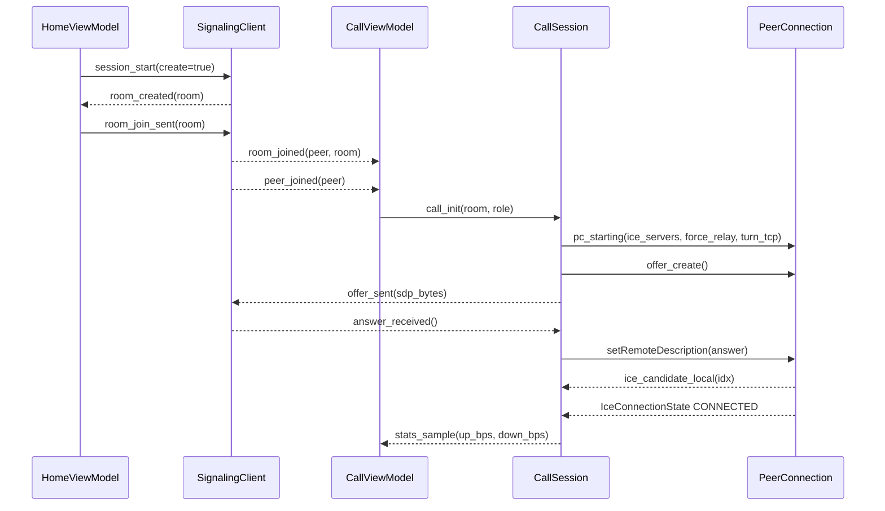
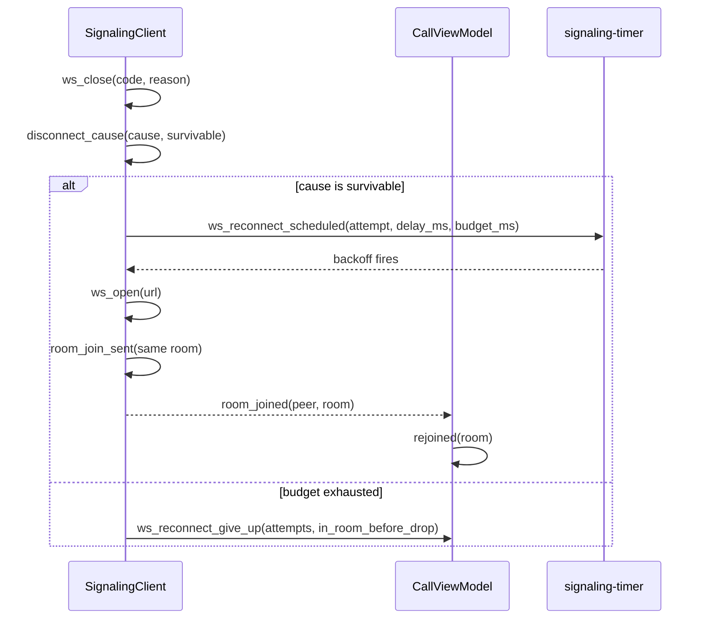
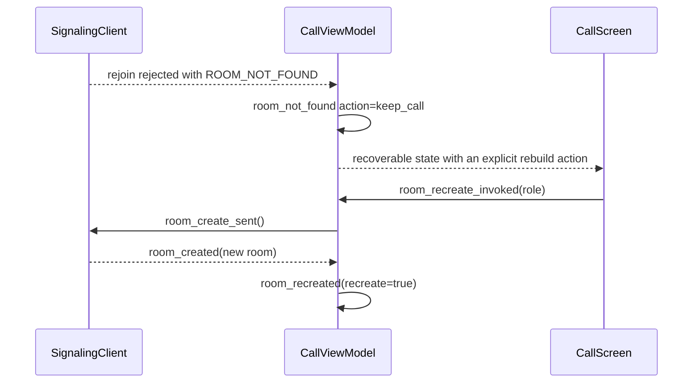
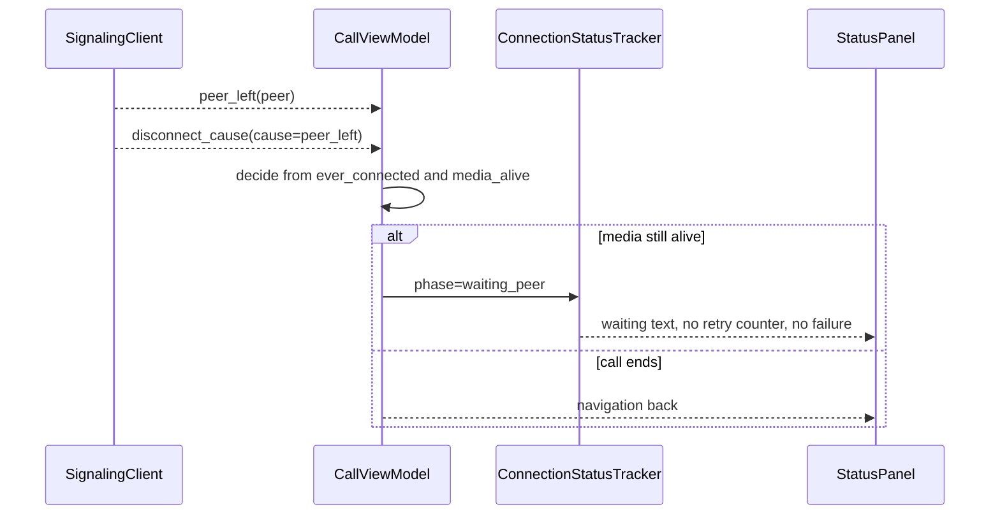
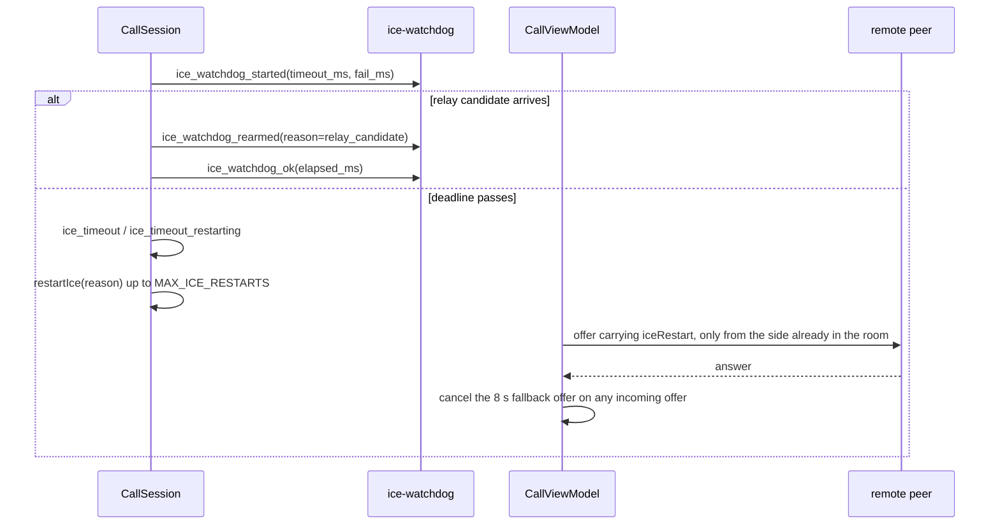
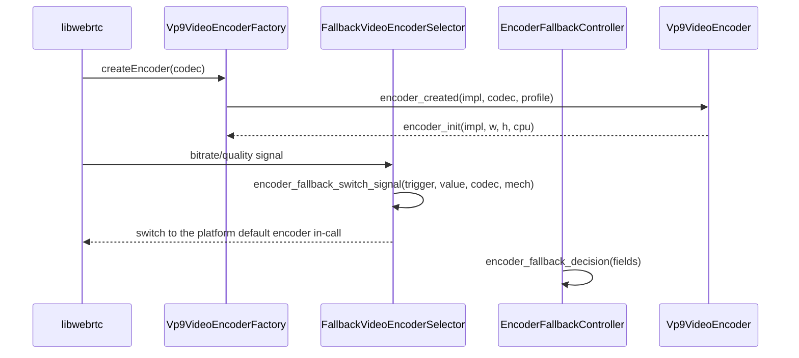
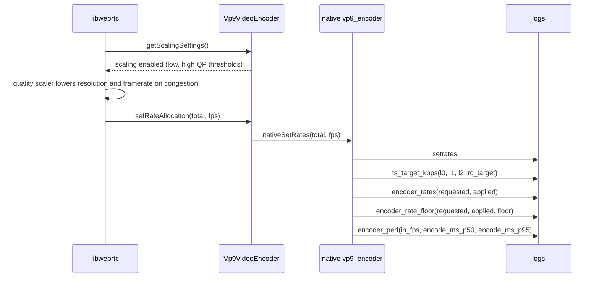

> **中文（默认）** · [English](../06-flows.md)
> 译文：若与英文原文冲突，以英文原文为准。

# 06 — 关键流程

> Status: draft · Owner: writer-app · Task: t3
> Evidence base: `reports/27-encoder-direction-perf.md`, `reports/34-turn-tcp-fallback.md`, `reports/35-room-grace.md`, `reports/36-call-survivability.md`, `reports/39-reconnect-budget-ice-restart.md`, `reports/40-glare-ice-restart-fix.md`, `reports/44-ice-watchdog-false-failure.md`, `reports/47-vp9-encode-perf.md`, `reports/48-encoder-fallback.md`, `reports/49-bitrate-allocation-collapse.md`, `reports/50-quality-scaling-and-render-fps.md`, `reports/51-frame-dropper-and-trusted-rc.md`; verbatim log lines from seven device captures under the container path pattern /data/dsh/home/workspace/tmp/n1…n7/x/.
> Doc standard: `doc/design/SPEC.md`

## 1. 范围

本文件追踪定义应用行为的七个流程。每个流程都有一张图、一份带源码引用的编号步骤清单，以及至少两行来自真实设备采集的逐字日志。日志行严格按原样引用，包括时间戳与线程 id 方括号，因为事件名之后的字段就是诊断契约。

日志证据以代码跨度中的裸容器路径引用 —— 例如 n1 应用日志 `/data/dsh/home/workspace/tmp/n1/x/app.log` —— 行号在正文中给出。行号刻意留在代码跨度之外：带行号后缀的容器路径会被门禁归类为仓库外引用，从而降级为警告而不是被校验。

## 2. 流程 1 — 创建房间、加入、首个 offer/answer 与 ICE 连通



步骤：

1. 首页发起会话：URL 与 create 标志在套接字打开之前就被记录（`app/src/main/kotlin/com/example/webrtcdemo/ui/home/HomeViewModel.kt:138`）。
2. 房间由传输层创建并加入，两种结果都被记录（`app/src/main/kotlin/com/example/webrtcdemo/signaling/SignalingClient.kt:587`，`app/src/main/kotlin/com/example/webrtcdemo/signaling/SignalingClient.kt:588`）。
3. 远端对端进入时，对端加入通知在编排层作出反应之前被记录（`app/src/main/kotlin/com/example/webrtcdemo/signaling/SignalingClient.kt:594`）。
4. 编排层进入通话，并记录角色、房间与世代（`app/src/main/kotlin/com/example/webrtcdemo/ui/call/CallViewModel.kt:584`）。
5. 会话连同传输决策一起宣告自身 —— ICE 服务器种类、强制中继，以及是否加入了 TURN-over-TCP 回退（`app/src/main/kotlin/com/example/webrtcdemo/webrtc/CallSession.kt:306`）。
6. 提议被创建并发送；两步都带字节数，使空或截断的 SDP 可见（`app/src/main/kotlin/com/example/webrtcdemo/webrtc/CallSession.kt:420`，`app/src/main/kotlin/com/example/webrtcdemo/webrtc/CallSession.kt:430`）。
7. 应答侧镜像同样两个事件（`app/src/main/kotlin/com/example/webrtcdemo/webrtc/CallSession.kt:497`，`app/src/main/kotlin/com/example/webrtcdemo/webrtc/CallSession.kt:507`）。
8. 本地候选逐条记录，因此 host/srflx/relay 的构成可按候选审计（`app/src/main/kotlin/com/example/webrtcdemo/webrtc/CallSession.kt:900`）。

设备实测 —— n1 上的房间创建（`/data/dsh/home/workspace/tmp/n1/x/app.log`，第 40 行）、对端加入（第 89 行）、提议（第 95 与 99 行）以及首个本地候选（第 102 行）：

```text
2026-09-16T03:34:08.932Z INFO    kotlin signaling [2098/10251] room_created room=2C5MZN
2026-09-16T03:34:24.659Z INFO    kotlin signaling [2098/10251] peer_joined peer=peer-002
2026-09-16T03:34:24.677Z INFO    kotlin pc        [2098/10269] offer_created candidates=- evt=6 sdp_bytes=2528 session=s1
2026-09-16T03:34:24.732Z INFO    kotlin signaling [2098/10269] offer_sent sdp_bytes=2528
2026-09-16T03:34:24.758Z INFO    kotlin pc        [2098/10269] ice_candidate_local evt=8 idx=0 local=type=host_proto=udp_addr=192.168.1.100_port=45509 mid=0 session=s1
```

后续一次会话在 n2 上的应答侧（`/data/dsh/home/workspace/tmp/n2/x/app.log`，第 13057 行）：

```text
2026-09-16T07:39:21.475Z INFO    kotlin pc        [28710/783] answer_created candidates=- evt=9 sdp_bytes=2450 session=s2
```

References: `app/src/main/kotlin/com/example/webrtcdemo/ui/home/HomeViewModel.kt:138`,
`app/src/main/kotlin/com/example/webrtcdemo/signaling/SignalingClient.kt:587`,
`app/src/main/kotlin/com/example/webrtcdemo/signaling/SignalingClient.kt:588`,
`app/src/main/kotlin/com/example/webrtcdemo/signaling/SignalingClient.kt:594`,
`app/src/main/kotlin/com/example/webrtcdemo/ui/call/CallViewModel.kt:584`,
`app/src/main/kotlin/com/example/webrtcdemo/webrtc/CallSession.kt:306`,
`app/src/main/kotlin/com/example/webrtcdemo/webrtc/CallSession.kt:420`,
`app/src/main/kotlin/com/example/webrtcdemo/webrtc/CallSession.kt:430`,
`app/src/main/kotlin/com/example/webrtcdemo/webrtc/CallSession.kt:497`,
`app/src/main/kotlin/com/example/webrtcdemo/webrtc/CallSession.kt:507`,
`app/src/main/kotlin/com/example/webrtcdemo/webrtc/CallSession.kt:900`

## 3. 流程 2 — 瞬时信令断开、重连与收回席位



步骤：

1. 套接字关闭连同其 code 与 reason 被记录（`app/src/main/kotlin/com/example/webrtcdemo/signaling/SignalingClient.kt:313`）。
2. 在尝试任何恢复之前，该关闭先被分类为可存活或致命原因（`app/src/main/kotlin/com/example/webrtcdemo/signaling/SignalingClient.kt:790`）。
3. 可存活的关闭按重连退避安排重连 —— 基数 1 s、上限 8 s、最多十次尝试（`app/src/main/kotlin/com/example/webrtcdemo/signaling/SignalingClient.kt:145`，`app/src/main/kotlin/com/example/webrtcdemo/signaling/SignalingClient.kt:749`）；该调度行携带总预算，因此采集能证明它所用的是哪个窗口。
4. 成功后客户端重新加入同一房间，传输层记录这次加入（`app/src/main/kotlin/com/example/webrtcdemo/signaling/SignalingClient.kt:588`）。
5. 编排层记下通话在这次断开中存活了下来（`app/src/main/kotlin/com/example/webrtcdemo/ui/call/CallViewModel.kt:869`）。
6. 若预算耗尽，客户端显式放弃，并记录断开发生时设备是否在房间内（`app/src/main/kotlin/com/example/webrtcdemo/signaling/SignalingClient.kt:731`）。

设备实测 —— n2 上的一次断开与成功收回（`/data/dsh/home/workspace/tmp/n2/x/app.log`，第 1222、1223、1244 与 1246 行）：

```text
2026-09-16T03:35:09.217Z WARN    kotlin signaling [2098/10251] ws_close code=- reason=failure
2026-09-16T03:35:09.217Z WARN    kotlin signaling [2098/10251] ws_reconnect_scheduled attempt=1 budget_ms=63000 delay_ms=1000 max_attempts=10 reason=failure
2026-09-16T03:35:11.355Z INFO    kotlin signaling [2098/10251] room_joined peer=peer-001 room=2C5MZN
2026-09-16T03:35:11.356Z INFO    kotlin pc        [2098/10251] rejoined room=2C5MZN
```

n7 上的耗尽路径（`/data/dsh/home/workspace/tmp/n7/x/app.1.log`，第 5991 行）：

```text
2026-09-16T15:40:57.107Z ERROR   kotlin signaling [2568/14461] ws_reconnect_give_up attempts=11 budget_ms=63000 in_room_before_drop=true room=FANFQ2
```

References: `app/src/main/kotlin/com/example/webrtcdemo/signaling/SignalingClient.kt:145`,
`app/src/main/kotlin/com/example/webrtcdemo/signaling/SignalingClient.kt:313`,
`app/src/main/kotlin/com/example/webrtcdemo/signaling/SignalingClient.kt:588`,
`app/src/main/kotlin/com/example/webrtcdemo/signaling/SignalingClient.kt:731`,
`app/src/main/kotlin/com/example/webrtcdemo/signaling/SignalingClient.kt:749`,
`app/src/main/kotlin/com/example/webrtcdemo/signaling/SignalingClient.kt:790`,
`app/src/main/kotlin/com/example/webrtcdemo/ui/call/CallViewModel.kt:869`

## 4. 流程 3 — 房间失效（房间不存在）与可恢复状态



步骤：

1. 在重连期间被收回的房间会以 `ROOM_LOST` 显现，按其构造即为可存活的（`app/src/main/kotlin/com/example/webrtcdemo/signaling/SignalingClient.kt:798`）。
2. 编排层保留通话而不是挂断，并连同阶段与媒体状态记录该决定（`app/src/main/kotlin/com/example/webrtcdemo/ui/call/CallViewModel.kt:1062`）。
3. 用户获得一个显式的重建入口（`app/src/main/kotlin/com/example/webrtcdemo/ui/call/CallViewModel.kt:693`）。
4. 成功的重建连同新房间与同一世代被宣告（`app/src/main/kotlin/com/example/webrtcdemo/ui/call/CallViewModel.kt:837`）。
5. 若因房间已满而无法重建，则单独报告，而不是作为致命错误（`app/src/main/kotlin/com/example/webrtcdemo/ui/call/CallViewModel.kt:1046`）。

设备实测 —— n6 上的可恢复决定（`/data/dsh/home/workspace/tmp/n6/x/app.2.log`，第 13492 行）：

```text
2026-09-16T15:55:54.455Z WARN    kotlin pc        [20650/24180] room_not_found_action=keep_call code=ROOM_NOT_FOUND media_age_ms=-1 media_alive=true phase=connected rejoin_context=true rejoin_drop=true seq=3 session=s3
```

n7 上的重建（`/data/dsh/home/workspace/tmp/n7/x/app.1.log`，第 6624 与 6634 行）：

```text
2026-09-16T15:55:56.139Z WARN    kotlin pc        [2568/2568] room_recreate_invoked media_alive=true role=joiner room=FANFQ2 seq=5 session=s5
2026-09-16T15:55:56.337Z INFO    kotlin pc        [2568/16211] room_recreated recreate=true room=XUWTS7 seq=5 session=s5
```

References: `app/src/main/kotlin/com/example/webrtcdemo/signaling/SignalingClient.kt:798`,
`app/src/main/kotlin/com/example/webrtcdemo/ui/call/CallViewModel.kt:693`,
`app/src/main/kotlin/com/example/webrtcdemo/ui/call/CallViewModel.kt:837`,
`app/src/main/kotlin/com/example/webrtcdemo/ui/call/CallViewModel.kt:1046`,
`app/src/main/kotlin/com/example/webrtcdemo/ui/call/CallViewModel.kt:1062`

## 5. 流程 4 — 对端离开、等待对端、再次进入



步骤：

1. 传输层报告对端离开，随后把由此产生的断开分类（`app/src/main/kotlin/com/example/webrtcdemo/signaling/SignalingClient.kt:595`，`app/src/main/kotlin/com/example/webrtcdemo/signaling/SignalingClient.kt:533`）。
2. 编排层用同一行上记录的两个输入决定是否保留通话：该通话此前是否曾连接成功，以及媒体是否仍在流动（`app/src/main/kotlin/com/example/webrtcdemo/ui/call/CallViewModel.kt:912`）。
3. 另一分支结束该世代的通话（`app/src/main/kotlin/com/example/webrtcdemo/ui/call/CallViewModel.kt:935`）。
4. 中性的等待阶段是一等状态，而不是错误（`app/src/main/kotlin/com/example/webrtcdemo/ui/call/ConnectionStatus.kt:33`）。
5. 该阶段连同原因、存活证据与世代一起发布（`app/src/main/kotlin/com/example/webrtcdemo/ui/call/CallViewModel.kt:1475`），承载它的字段名与采集中的写法完全一致（`app/src/main/kotlin/com/example/webrtcdemo/ui/call/CallViewModel.kt:465`）。

设备实测 —— n2 上的对端离开（`/data/dsh/home/workspace/tmp/n2/x/app.log`，第 7103 与 7104 行）：

```text
2026-09-16T03:39:43.060Z INFO    kotlin signaling [11943/14419] peer_left peer=peer-002
2026-09-16T03:39:43.061Z WARN    kotlin signaling [11943/14419] disconnect_cause cause=peer_left peer_left=true
```

n1 上通话开始时的等待阶段（`/data/dsh/home/workspace/tmp/n1/x/app.log`，第 47 行）：

```text
2026-09-16T03:34:09.155Z INFO    kotlin pc        [2098/2098] ui_conn_state elapsed_ms=0 frame=false ice_down=false media_age_ms=-1 media_source=none pair=false phase=waiting_peer reason=none retry=0 seq=1 session=s0 stalled=false
```

注意，保留通话这一分支本身在这七次会话中未被采集：观察到的每一条 `peer_left` 行都只是裸通知，任何采集里都没有出现 `peer_left action=keep_call` 行。因此该分支是从代码记录的，而不是来自设备观察。

References: `app/src/main/kotlin/com/example/webrtcdemo/signaling/SignalingClient.kt:533`,
`app/src/main/kotlin/com/example/webrtcdemo/signaling/SignalingClient.kt:595`,
`app/src/main/kotlin/com/example/webrtcdemo/ui/call/CallViewModel.kt:465`,
`app/src/main/kotlin/com/example/webrtcdemo/ui/call/CallViewModel.kt:912`,
`app/src/main/kotlin/com/example/webrtcdemo/ui/call/CallViewModel.kt:935`,
`app/src/main/kotlin/com/example/webrtcdemo/ui/call/CallViewModel.kt:1475`,
`app/src/main/kotlin/com/example/webrtcdemo/ui/call/ConnectionStatus.kt:33`

## 6. 流程 5 — ICE 重启与防冲突分工



步骤：

1. 看门狗在每个会话布防一次，两个阈值在同一行上，并带上是否配置了 TURN（`app/src/main/kotlin/com/example/webrtcdemo/webrtc/CallSession.kt:1125`）。
2. 中继候选到达时会重新布防该截止时间，而不是让原来的截止时间到期（`app/src/main/kotlin/com/example/webrtcdemo/webrtc/CallSession.kt:1346`）。
3. 连通性被证明后看门狗停止，并记录其耗时（`app/src/main/kotlin/com/example/webrtcdemo/webrtc/CallSession.kt:1380`）。
4. 错过截止时间会连同完整候选与传输上下文一起记录，这正是让误报失败可被诊断的原因（`app/src/main/kotlin/com/example/webrtcdemo/webrtc/CallSession.kt:1233`，`app/src/main/kotlin/com/example/webrtcdemo/webrtc/CallSession.kt:1225`）。
5. 重启是有界的：最多两次尝试（`app/src/main/kotlin/com/example/webrtcdemo/webrtc/CallSession.kt:100`），经单一方法发起（`app/src/main/kotlin/com/example/webrtcdemo/webrtc/CallSession.kt:1272`）。
6. 只有原本已在房间内的一方重新协商；重连方只应答，并布防一个 8 s 的兜底提议（`app/src/main/kotlin/com/example/webrtcdemo/ui/call/CallSurvivability.kt:147`），一旦收到远端提议或应答，该兜底立即取消（`app/src/main/kotlin/com/example/webrtcdemo/ui/call/CallViewModel.kt:875`）。

设备实测 —— n1 上的看门狗生命周期（`/data/dsh/home/workspace/tmp/n1/x/app.log`，第 129、115 与 163 行）：

```text
2026-09-16T03:34:25.130Z INFO    kotlin pc        [2098/10251] ice_watchdog_started evt=22 fail_ms=45000 session=s1 timeout_ms=30000 turn_configured=true
2026-09-16T03:34:24.872Z INFO    kotlin pc        [2098/10269] ice_watchdog_rearmed candidate=type=relay_proto=udp_addr=47.238.144.66_port=49181 elapsed_ms=1789529664872 evt=16 reason=relay_candidate relay=1 session=s1
2026-09-16T03:34:25.436Z INFO    kotlin pc        [2098/10269] ice_watchdog_ok elapsed_ms=306
```

n3 上的防冲突延后（`/data/dsh/home/workspace/tmp/n3/x/app.1.log`，第 47 行）：

```text
2026-09-16T03:34:24.955Z WARN    kotlin pc        [21491/21555] offer_deferred evt=3 reason=pc_not_ready sdp_bytes=2528 session=s1 start_in_flight=true
```

重要限制：重启分支本身在这七次采集中从未被触发过。采集集中每个重启计数器都是零，任何地方都没有出现重启请求、重启耗尽或重启用失败的行。因此重启机制是从代码记录的，采集到的证据只覆盖看门狗路径与延后路径。

References: `app/src/main/kotlin/com/example/webrtcdemo/webrtc/CallSession.kt:100`,
`app/src/main/kotlin/com/example/webrtcdemo/webrtc/CallSession.kt:1225`,
`app/src/main/kotlin/com/example/webrtcdemo/webrtc/CallSession.kt:1233`,
`app/src/main/kotlin/com/example/webrtcdemo/webrtc/CallSession.kt:1272`,
`app/src/main/kotlin/com/example/webrtcdemo/webrtc/CallSession.kt:1346`,
`app/src/main/kotlin/com/example/webrtcdemo/webrtc/CallSession.kt:1380`,
`app/src/main/kotlin/com/example/webrtcdemo/ui/call/CallSurvivability.kt:147`,
`app/src/main/kotlin/com/example/webrtcdemo/ui/call/CallViewModel.kt:875`

## 7. 流程 6 — 自建编码器跟不上时的编码器兜底



步骤：

1. 工厂为每个编解码器选择一个编码器，并连同机制记录其实现（`app/src/main/kotlin/com/example/webrtcdemo/encoder/Vp9VideoEncoderFactory.kt:61`）。
2. 若没有可用的兜底编码器，工厂会记录这一事实，而不是静默失败（`app/src/main/kotlin/com/example/webrtcdemo/encoder/Vp9VideoEncoderFactory.kt:74`）。
3. 切换请求连同其触发原因、观测值、编解码器与机制被宣告（`app/src/main/kotlin/com/example/webrtcdemo/encoder/FallbackVideoEncoderSelector.kt:95`）。
4. 无法被满足的切换请求会连同其原因被记录（`app/src/main/kotlin/com/example/webrtcdemo/encoder/FallbackVideoEncoderSelector.kt:88`）。
5. 决策层把它的结论作为专用事件发布（`app/src/main/kotlin/com/example/webrtcdemo/encoder/EncoderFallbackController.kt:618`）。
6. 编码器自身经原生桥初始化，并报告协商后的尺寸与 CPU 数量（`app/src/main/kotlin/com/example/webrtcdemo/encoder/Vp9VideoEncoder.kt:118`）。

设备实测 —— n1 上自建编码器被创建并初始化（`/data/dsh/home/workspace/tmp/n1/x/app.log`，第 136 与 138 行）：

```text
2026-09-16T03:34:25.178Z INFO    kotlin encoder   [2098/10598] encoder_created codec=VP9 impl=SelfVp9Libvpx profile=0
2026-09-16T03:34:25.197Z INFO    kotlin encoder   [2098/10598] encoder_init cpu=8 h=480 impl=SelfVp9Libvpx s=1 t=3 w=640
```

n6 上一次真实的通话内切换（`/data/dsh/home/workspace/tmp/n6/x/app.1.log`，第 5438 行）：

```text
2026-09-17T04:20:40.919Z INFO    kotlin encoder   [28910/29454] encoder_fallback_switch_signal codec=VP9 mech=in_call_switch trigger=bitrate value=298
```

References: `app/src/main/kotlin/com/example/webrtcdemo/encoder/Vp9VideoEncoderFactory.kt:61`,
`app/src/main/kotlin/com/example/webrtcdemo/encoder/Vp9VideoEncoderFactory.kt:74`,
`app/src/main/kotlin/com/example/webrtcdemo/encoder/FallbackVideoEncoderSelector.kt:88`,
`app/src/main/kotlin/com/example/webrtcdemo/encoder/FallbackVideoEncoderSelector.kt:95`,
`app/src/main/kotlin/com/example/webrtcdemo/encoder/EncoderFallbackController.kt:618`,
`app/src/main/kotlin/com/example/webrtcdemo/encoder/Vp9VideoEncoder.kt:118`

## 8. 流程 7 — 质量降级与丢弃策略



步骤：

1. 编码器声明支持质量降级，而不是把它禁用：阈值由真实实现返回（`app/src/main/kotlin/com/example/webrtcdemo/encoder/Vp9VideoEncoder.kt:339`，`app/src/main/kotlin/com/example/webrtcdemo/encoder/Vp9VideoEncoder.kt:340`），源码解释了此前把它关掉为何对拥塞处理是错的（`app/src/main/kotlin/com/example/webrtcdemo/encoder/Vp9VideoEncoder.kt:331`）。
2. 帧丢弃器通过启动期 field trial 禁用，而不是在运行时禁用（`app/src/main/kotlin/com/example/webrtcdemo/webrtc/WebRtcEngine.kt:164`）。
3. Kotlin 层施加的码率目标由原生编码器镜像，后者记录目标值与各层分配（`app/src/main/kotlin/com/example/webrtcdemo/encoder/Vp9VideoEncoder.kt:300`，`app/src/main/cpp/encoder/vp9_encoder.cpp:412`）。
4. 原生编码器记录请求码率与实际施加码率，以及是否必须遵守某个地板（`app/src/main/cpp/encoder/vp9_encoder.cpp:477`，`app/src/main/cpp/encoder/vp9_encoder.cpp:468`）。
5. 逐窗口的编码性能连同输入帧率与百分位编码耗时被记录（`app/src/main/cpp/encoder/vp9_encoder.cpp:906`）。
6. 接收端与渲染端的丢弃计数器是 libwebrtc 内部实现，本仓库中没有源码侧键；它们按报告小节引用（`reports/50-quality-scaling-and-render-fps.md` §2.3），并在下方从 webrtc 通道引用。

设备实测 —— n6 上帧丢弃器被禁用（`/data/dsh/home/workspace/tmp/n6/x/app.2.log`，第 6170 行）：

```text
2026-09-16T15:34:23.898Z INFO    kotlin pc        [20650/20650] field_trials_set frame_dropper=WebRTC-FrameDropper/Disabled/
```

n4 上的原生码率与性能证据（`/data/dsh/home/workspace/tmp/n4/x/native.1.log`，第 1、105 与 1307 行）：

```text
2026-09-16T11:59:31.811Z INFO    native bitrate   [16468/16580] encoder_rates requested_bps=1966454 applied_total_bps=1967000 fps=23 layers=1,3 debounced=1
2026-09-16T11:59:32.222Z INFO    native encoder   [16468/16580] encoder_perf frames=60 encode_ms_p50=13.781 encode_ms_p95=18.183 encode_ms_max=23.224 in_fps=23 no_output=0 total=240
2026-09-16T11:59:58.332Z WARN    native bitrate   [16468/16580] encoder_rate_floor requested_bps=28111 applied_bps=30000 floor_kbps=30
```

n1 上的各层目标（`/data/dsh/home/workspace/tmp/n1/x/native.log`，第 17 行）：

```text
2026-09-16T03:34:25.196Z INFO    native bitrate   [2098/10598] ts_target_kbps l0=120 l1=210 l2=300 rc_target_kbps=300
```

n2 上的渲染端丢弃计数器（`/data/dsh/home/workspace/tmp/n2/x/webrtc.log`，第 349 行）：

```text
2026-09-16T07:39:48.991Z INFO    webrtc webrtc_video_render_fram [28710/781] (line_50):_WebRTC.Video.DroppedFrames.RenderQueue_24_
```

References: `app/src/main/kotlin/com/example/webrtcdemo/encoder/Vp9VideoEncoder.kt:300`,
`app/src/main/kotlin/com/example/webrtcdemo/encoder/Vp9VideoEncoder.kt:331`,
`app/src/main/kotlin/com/example/webrtcdemo/encoder/Vp9VideoEncoder.kt:339`,
`app/src/main/kotlin/com/example/webrtcdemo/encoder/Vp9VideoEncoder.kt:340`,
`app/src/main/kotlin/com/example/webrtcdemo/webrtc/WebRtcEngine.kt:164`,
`app/src/main/cpp/encoder/vp9_encoder.cpp:412`,
`app/src/main/cpp/encoder/vp9_encoder.cpp:468`,
`app/src/main/cpp/encoder/vp9_encoder.cpp:477`,
`app/src/main/cpp/encoder/vp9_encoder.cpp:906`,
`reports/50-quality-scaling-and-render-fps.md`

## 9. 证据索引

| 流程 | 关键声明 | 引用 | 设备证据 |
|---|---|---|---|
| 1 | 房间已创建并加入、对端已加入、offer/answer 已交换 | `app/src/main/kotlin/com/example/webrtcdemo/signaling/SignalingClient.kt:587` | n1 `app.log` 第 40、89、95、99 行 |
| 2 | 断开可存活，并在约 63 s 预算内恢复 | `app/src/main/kotlin/com/example/webrtcdemo/signaling/SignalingClient.kt:749` | n2 `app.log` 第 1222、1223、1244、1246 行 |
| 2 | 预算耗尽被显式记录，不静默 | `app/src/main/kotlin/com/example/webrtcdemo/signaling/SignalingClient.kt:731` | n7 `app.1.log` 第 5991 行 |
| 3 | 被回收的房间保留通话并提供重建入口 | `app/src/main/kotlin/com/example/webrtcdemo/ui/call/CallViewModel.kt:1062` | n6 `app.2.log` 第 13492 行 |
| 3 | 重建在同一世代内产出新房间 | `app/src/main/kotlin/com/example/webrtcdemo/ui/call/CallViewModel.kt:837` | n7 `app.1.log` 第 6624、6634 行 |
| 4 | 对端离开在通话决策之前先被分类 | `app/src/main/kotlin/com/example/webrtcdemo/signaling/SignalingClient.kt:533` | n2 `app.log` 第 7103、7104 行 |
| 4 | 等待阶段是中性的：没有重试计数器，也不报失败 | `app/src/main/kotlin/com/example/webrtcdemo/ui/call/CallViewModel.kt:465` | n1 `app.log` 第 47 行 |
| 5 | 看门狗布防、收到中继候选后重新布防，并在连通被证明后停止 | `app/src/main/kotlin/com/example/webrtcdemo/webrtc/CallSession.kt:1125` | n1 `app.log` 第 115、129、163 行 |
| 5 | 重协商是单侧的，并带 8 s 兜底 | `app/src/main/kotlin/com/example/webrtcdemo/ui/call/CallSurvivability.kt:147` | n3 `app.1.log` 第 47 行 |
| 6 | 通话内编码器切换连同其触发原因被宣告 | `app/src/main/kotlin/com/example/webrtcdemo/encoder/FallbackVideoEncoderSelector.kt:95` | n6 `app.1.log` 第 5438 行 |
| 7 | 为拥塞处理保持启用质量降级 | `app/src/main/kotlin/com/example/webrtcdemo/encoder/Vp9VideoEncoder.kt:339` | n4 `native.1.log` 第 1、1307 行 |
| 7 | 帧丢弃器由 field trial 禁用；编码性能被记录 | `app/src/main/kotlin/com/example/webrtcdemo/webrtc/WebRtcEngine.kt:164` | n6 `app.2.log` 第 6170 行；n4 `native.1.log` 第 105 行 |

## 10. 待办事项

* **重启路径未经采集验证。** 七次设备采集中不存在任何 ICE 重启、重启耗尽或重启用失败的行；流程 5 只能从代码记录这些分支。在重启路径可被称为已验证之前，需要一次强制触发重启的采集。
* **流程 4 的保留通话分支未经采集验证。** 任何采集中都不存在保留通话的动作行；只观察到裸的对端离开通知与等待阶段。
* **丢弃计数器没有源码侧键。** 渲染端与接收端的丢弃计数器存在于二进制制品与 `reports/**` 中；它们只按报告小节引用，从不作为源码符号引用。
* **行号会衰减。** 本文件中的每条引用都对照当前 HEAD 校验过。此后对应用源码的提交会使它们失效，而交付门禁正是捕获这一点的机制：任何源码变更后运行 `bash scripts/doc-verify.sh --only docs/06-flows.md`。
